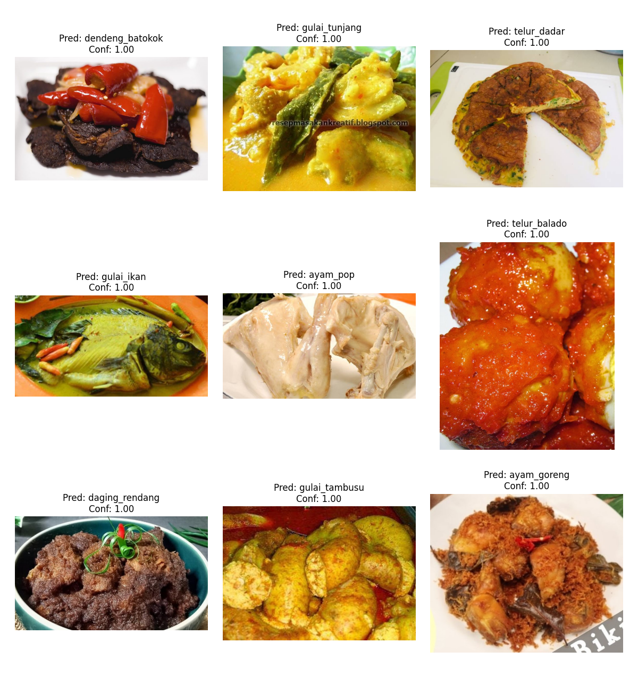
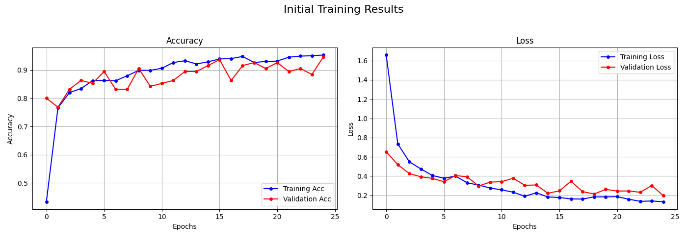

# **Deteksi Makanan Khas Padang menggunakan CNN (Transfer Learning)**

## **Deskripsi Proyek**

Proyek ini bertujuan untuk membangun sebuah model klasifikasi gambar menggunakan *Convolutional Neural Network* (CNN) untuk mendeteksi 9 jenis makanan khas Padang. Model ini dikembangkan dengan teknik *Transfer Learning* menggunakan arsitektur **MobileNetV2** yang telah dilatih pada dataset ImageNet.

Dataset yang digunakan adalah **"Padang Food"** dari Kaggle Hub, yang berisi total 993 gambar. Proyek ini mencakup seluruh alur kerja machine learning, mulai dari akuisisi data, preprocessing, augmentasi, pelatihan model (feature extraction dan fine-tuning), hingga evaluasi dan penyimpanan model untuk potensi deployment, termasuk konversi ke format TensorFlow.js.

## **Tim Pengembang**

Proyek ini dikembangkan oleh:

1. Ayu Anggraini        (G1A022007)
2. Anissa Shanniyah A.  (G1A022044)
3. Alif Nurhidayat      (G1A022073)

## **Live Demo & Implementasi**

Anda dapat melihat implementasi dan mencoba model secara langsung melalui tautan berikut:

* **Kode Sumber di GitHub**: [KillerKing93/Inferensi-cnn-tfjs](https://github.com/KillerKing93/Inferensi-cnn-tfjs?authuser=5)  
* **Deployment di GitHub Pages**: [Lihat Demo](https://killerking93.github.io/Inferensi-cnn-tfjs/)  
* **Deployment di Custom Server**: [Lihat Demo](https://craftthingy.com/inference-tfjs-cnn/)

## **Fitur Utama**

* **Klasifikasi 9 Jenis Makanan**: Mampu mengenali ayam goreng, ayam pop, daging rendang, dendeng batokok, gulai ikan, gulai tambusu, gulai tunjang, telur balado, dan telur dadar.  
* **Akurasi Tinggi**: Mencapai akurasi **\~99%** pada set data pengujian.  
* **Transfer Learning**: Menggunakan **MobileNetV2** sebagai model dasar untuk mempercepat proses pelatihan dan meningkatkan performa.  
* **Augmentasi Data**: Menerapkan teknik augmentasi (rotasi, zoom, pergeseran) untuk meningkatkan variasi data latih dan mencegah overfitting.  
* **Siap Deployment**: Model akhir disimpan dalam format .keras dan juga dikonversi ke format TensorFlow.js, sehingga siap untuk diintegrasikan ke dalam aplikasi web atau mobile.

## **Arsitektur Model**

Model ini dibangun menggunakan pendekatan Transfer Learning dengan arsitektur sebagai berikut:

1. **Model Dasar (Base Model)**: **MobileNetV2**  
   * Menggunakan bobot yang telah dilatih pada dataset **ImageNet**.  
   * Seluruh lapisan konvolusi pada model dasar dibekukan (*frozen*) selama tahap pelatihan awal (*feature extraction*).  
2. **Classifier Tambahan (Custom Head)**:  
   * GlobalAveragePooling2D: Untuk mereduksi dimensi fitur dari model dasar.  
   * Dense (128 neuron, ReLU): Lapisan tersembunyi untuk mempelajari pola yang lebih kompleks.  
   * Dropout (0.5): Untuk regularisasi dan mengurangi overfitting.  
   * Dense (9 neuron, Softmax): Lapisan output untuk klasifikasi multi-kelas.

### **Justifikasi Pemilihan MobileNetV2**

MobileNetV2 dipilih karena merupakan arsitektur yang ringan dan efisien, dirancang untuk aplikasi mobile dan perangkat dengan sumber daya terbatas. Meskipun ringan, model ini memberikan performa yang sangat baik untuk tugas klasifikasi gambar.

## **Metodologi Proyek**

Proyek ini mengikuti alur kerja standar dalam pengembangan model *Deep Learning*:

1. **Akuisisi & Persiapan Data**:  
   * Dataset diunduh secara otomatis dari **Kaggle Hub** (faldoae/padangfood).  
   * Data disalin ke direktori *writable* untuk diproses lebih lanjut.  
   * Menggunakan split-folders, data dibagi menjadi tiga set dengan rasio **80% (latih), 10% (validasi), dan 10% (uji)**.  
2. **Preprocessing & Augmentasi Data**:  
   * Gambar diubah ukurannya menjadi **224x224 piksel**.  
   * Menggunakan ImageDataGenerator dari Keras untuk:  
     * Normalisasi nilai piksel ke rentang \[0, 1\].  
     * Augmentasi data latih dengan rotasi, pergeseran, zoom, dan shear.  
3. **Pembangunan & Pelatihan Model**:  
   * **Tahap 1: Feature Extraction**: Melatih hanya lapisan *classifier* tambahan selama **25 epoch** dengan *learning rate* standar.  
   * **Tahap 2: Fine-Tuning**: Membuka beberapa lapisan teratas dari model dasar (MobileNetV2) dan melatih kembali seluruh model dengan *learning rate* yang sangat kecil (1e-5) selama **15 epoch** untuk penyesuaian yang lebih halus.  
4. **Evaluasi**:  
   * Model dievaluasi pada set data uji yang belum pernah dilihat sebelumnya.  
   * Metrik evaluasi yang digunakan meliputi **akurasi, loss, classification report, dan confusion matrix**.  
5. **Deployment**:  
   * Model Keras (.h5) dan daftar nama kelas (.txt) disimpan.  
   * Model dikonversi ke format **TensorFlow.js** untuk potensi penggunaan di sisi klien (browser).

## **Kebutuhan Sistem (Requirements)**

Proyek ini memerlukan beberapa pustaka Python utama. Anda dapat menginstalnya menggunakan pip:

pip install tensorflow==2.15.0 matplotlib tensorflowjs h5py kagglehub split-folders

* tensorflow: Framework utama untuk deep learning.  
* matplotlib: Untuk visualisasi data dan hasil.  
* tensorflowjs: Untuk mengonversi model Keras ke format JS.  
* kagglehub: Untuk mengunduh dataset dari Kaggle.  
* split-folders: Untuk membagi dataset menjadi set latih, validasi, dan uji.

## **Cara Menjalankan**

1. **Pastikan Kebutuhan Terpenuhi**: Instal semua pustaka yang tercantum di atas.  
2. **Koneksi Kaggle**: Untuk mengunduh dataset secara otomatis, pastikan Anda telah mengonfigurasi kredensial Kaggle Anda di lingkungan eksekusi (misalnya, dengan mengunggah file kaggle.json di Google Colab).  
3. **Jalankan Notebook**: Buka file .ipynb di lingkungan seperti Jupyter Notebook atau Google Colab dan jalankan sel-sel secara berurutan.

## **Hasil & Evaluasi**

* **Akurasi Pelatihan Awal**: \~92% pada set validasi.  
* **Akurasi Akhir (Fine-Tuning)**: **\~99.07%** pada set data uji.  
* **Visualisasi Hasil**:

* **Grafik Akurasi & Loss**: Menunjukkan performa model selama pelatihan dan validasi.

  

  * Contoh Hasil Dari Percobaan Inferensi Di Notebook.
